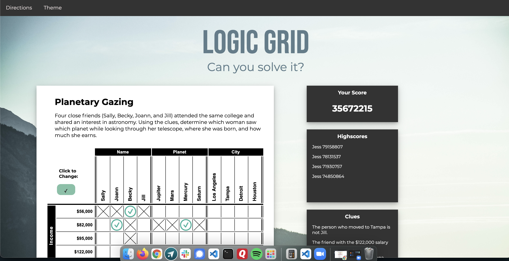

# README

# Logic Grid: Backend

Logic Grid is a website for those who love logic puzzles, but wants a site that has a calm, modern interface that allows for easier concentration without the distractions of ads and pop-ups.  

This is the rails API that provides the games, solutions, and highscores for the game using a PostgreSQL databse. Please use in conjunction with Logic Grid: Frontend or create your own.

### [View the Demo](https://youtu.be/OohM3gDU7gM)
<br>




## Installation

To install program fork the program and copy the ssh link. Navigate to the folder of choice using  ```cd folder_name/``` replacing folder_name with the correct name. Once in the folder type ```git clone ssh_link``` replacing ssh_link with the one that was obtained earlier and hit enter. Before running this program, run ```bundle install``` in the terminal to install necessary gems. To run type ```rails s``` and go to http://127.0.0.1:3000 in browser to use the app.

## Frontend Repo
Located at https://github.com/JessAntunes/logic-grid-frontend

## Contributors 

If you wish to contribute to this program please submit a pull request or a new issue.

## License

This program is licensed under The MIT License (https://opensource.org/licenses/MIT). License file included.

## Sources

https://rubygems.org/ 
